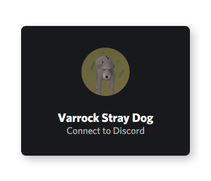

# [Varrock Stray Dog](https://varrock-stray.dog)

Varrock stray dog is a discord loot & pet tracking bot for Oldschool Runescape.

It utilizes the [@nrwl/nx](https://github.com/nrwl/nx) monorepo structure for [NestJS](https://github.com/nestjs/nest), [Angular](https://github.com/angular/angular), [Necord](https://github.com/necordjs/necord) and [other utilities](https://github.com/varrock-stray-dog/Varrock-Stray-Dog/tree/master/packages)

## Apps

### Web

The website for the bot, this will include a management system to manage your guild's loot & pets. This can also be done through commands.

### Api

The GraphQL api & Microservice for the website and bot to gain information and access to the database.

### Bot

The Discord bot which communicates with the api (Redis Microservice) and Discord (Necord)

## Libraries

### @varrock-stray-dog/osrs-pets

A collection of all available pets in osrs

### @varrock-stray-dog/utilities

Simple utilities for the bot and api to use.

### @varrock-stray-dog/models

The GraphQL models used by the Api & Bot

### @varrock-stray-dog/item-sync

A simple cli to sync items from osrs wiki to the database

## Contributors ✨

<!-- ALL-CONTRIBUTORS-LIST:START - Do not remove or modify this section -->
<!-- prettier-ignore-start -->
<!-- markdownlint-disable -->
<table>
  <tr>
    <td align="center"><a href="https://jurien.dev"> <b>Jurien Hamaker</b></a> <a href="#infra-jurienhamaker" title="Infrastructure (Hosting, Build-Tools, etc)">🚇</a> <a href="https://github.com/varrock-stray-dog/varrock-stray-dog/commits?author=jurienhamaker" title="Tests">⚠️</a> <a href="https://github.com/varrock-stray-dog/varrock-stray-dog/commits?author=jurienhamaker" title="Documentation">📖</a> <a href="https://github.com/varrock-stray-dog/varrock-stray-dog/commits?author=jurienhamaker" title="Code">💻</a></td>
  </tr>
</table>

<!-- markdownlint-restore -->
<!-- prettier-ignore-end -->

<!-- ALL-CONTRIBUTORS-LIST:END -->